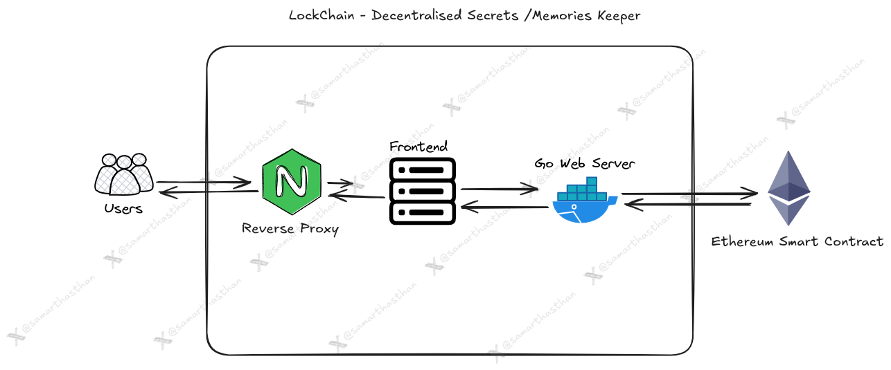

# LockChain - a Lifetime Secret / Memory Keeper Dapp

This project is a decentralized application (Dapp) built using Golang, Solidity for smart contracts, and Next.js for the frontend. The Dapp focuses on securely storing and managing personal secrets or memories.

## Tech Stack

- **Smart Contract Language:** Solidity
- **Backend Language:** Golang
- **Frontend Framework:** Next.js
- **Development Tools:** Truffle, Ganache, jq

## Architecture



## Getting Started

### Prerequisites

1. **Node.js**: Ensure Node.js is installed. Download it from [nodejs.org](https://nodejs.org/).
2. **Truffle**: Install Truffle globally:
   ```sh
   npm install -g truffle
   ```
3. **jq**: This project uses `jq` to process JSON files. Install `jq` based on your operating system:
   - **Ubuntu/Debian**:
     ```sh
     sudo apt-get install jq
     ```
   - **macOS**:
     ```sh
     brew install jq
     ```
   - **Windows**: Download `jq` from the [jq releases page](https://github.com/stedolan/jq/releases) and follow the installation instructions.

### Installation

1. **Clone the Repository**:
   ```sh
   git clone https://github.com/samarthasthan/lockchain.git
   ```

2. **Install Dependencies**:
   Navigate to the `smart-contract` directory and install the necessary dependencies:
   ```sh
   cd lifetime-secret-memory-keeper/smart-contract
   npm install
   ```

### Build the Contract

1. **Compile the Contract**:
   Compile the smart contract with:
   ```sh
   truffle compile
   ```
   This generates compiled contract artifacts in the `build/contracts/` directory.

### Migrate the Contract

1. **Deploy the Contract**:
   Ensure you have a blockchain environment set up (e.g., Ganache, an Ethereum testnet). Deploy the contract using:
   ```sh
   truffle migrate --network development
   ```
   Replace `development` with your network configuration if needed.


### Configuration

The `truffle-config.js` file contains configuration settings for Truffle, including network configurations and compiler settings. Modify this file according to your deployment environment.

### Running Ganache CLI

To run Ganache CLI with a specific network ID and accounts configuration:
```sh
ganache-cli  --networkId 1337 --host 0.0.0.0 --port 8545
```

### Additional Notes

- **Environment Variables**: Set up a `.env` file with necessary environment variables (e.g., private keys, Infura/Alchemy project IDs) if required by your configuration.
- **Truffle Documentation**: For more details on Truffle, refer to the [Truffle documentation](https://www.trufflesuite.com/docs/truffle/overview).

## Troubleshooting

- **Compilation Errors**: Ensure your Solidity code is correct and compatible with the compiler version specified in `truffle-config.js`.
- **Migration Issues**: Check migration scripts and ensure your blockchain environment is properly set up.

## License

This project is licensed under the MIT License. See the [LICENSE](../LICENSE) file for details.
